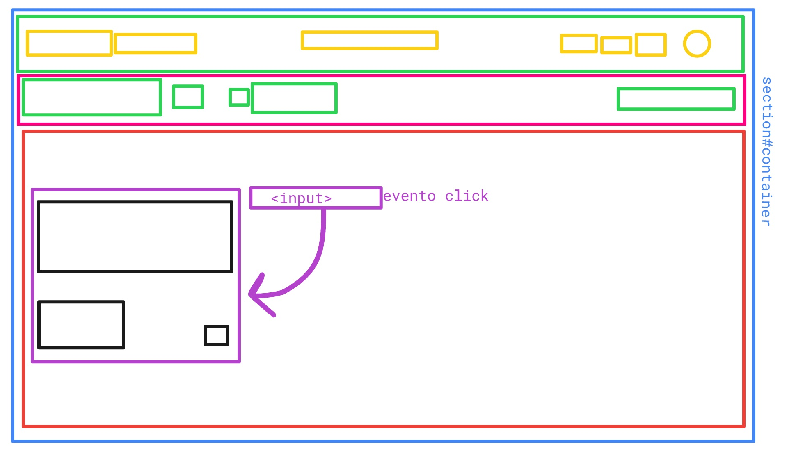

## RETO DE CÓDIGO: TRELLO

## OBJETIVO:
1. Replicar el newsfeed de Trello.

## PRIMERA PARTE: MAQUETADO Y ESTILO CSS
1. El archivo HTML se encuentra enlazado con su hoja de estilos en el archivo style.css.
2. El archivo HTML se encuentra enlazado con las fuentes necesarias a utilizar (Google Fonts).
3. El archivo HTML se encuentra enlazado con la libreria de iconos a utilizar.

## SEGUNDA PARTE: CREANDO UN SITIO INTERACTIVO CON JS
1. El archivo HTML se encuentra enlazado con el archivo app.js, las funciones corren de forma correcta.

