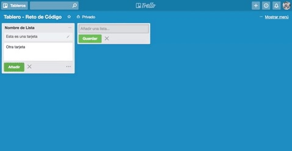
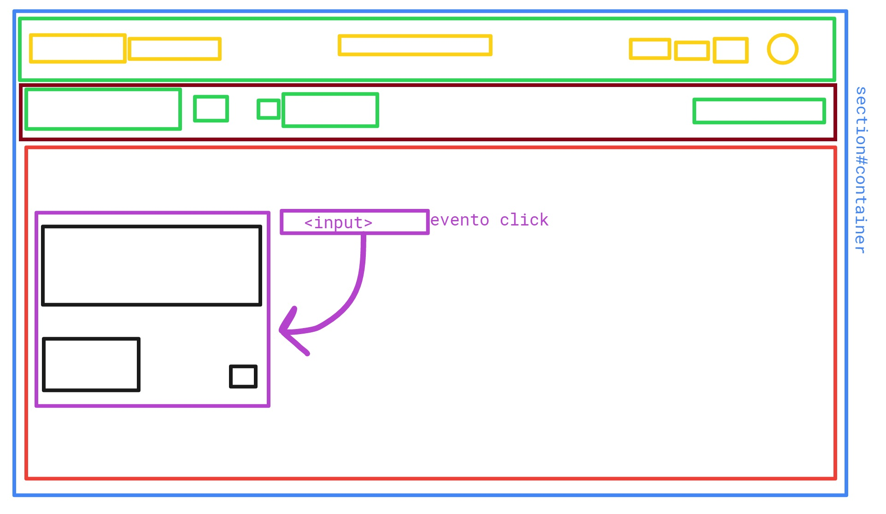

## RETO DE CÓDIGO: TRELLO

## OBJETIVO:
1. Replicar el newsfeed de Trello.

## PRIMERA PARTE: MAQUETADO Y ESTILO CSS
1. El archivo index.html se encuentra enlazado con su hoja de estilos en el archivo style.css.
2. El archivo HTML se encuentra enlazado con las fuentes necesarias a utilizar (Google Fonts).
3. El archivo HTML cuenta con tres elementos principales: un navegador, un article y un section.
4. Cada elemento cuenta con los atributos correspondientes para su función. 

## SEGUNDA PARTE: CREANDO UN SITIO INTERACTIVO CON JS

